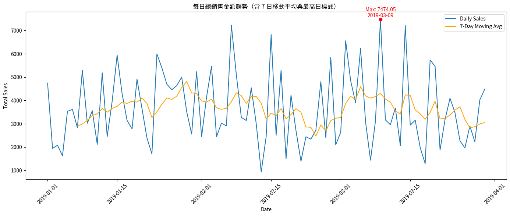
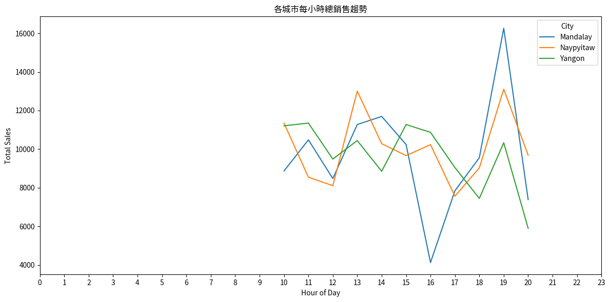
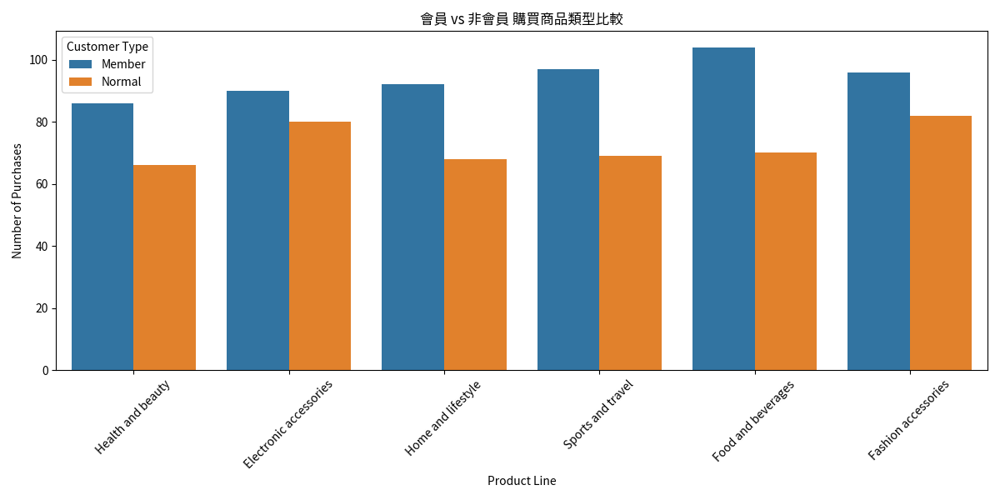
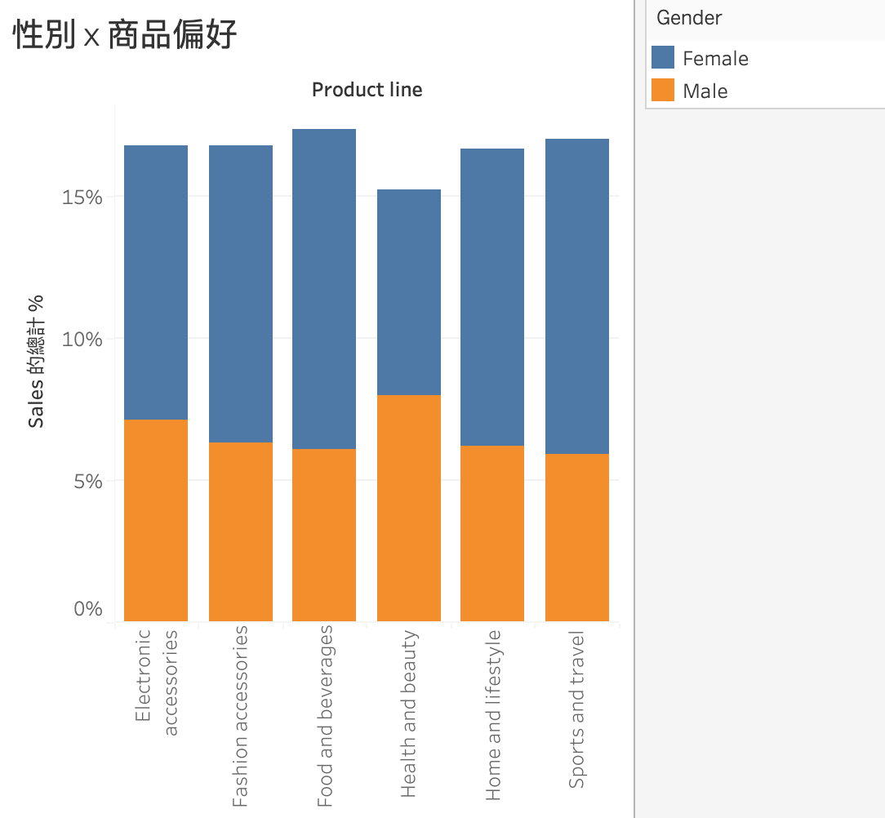
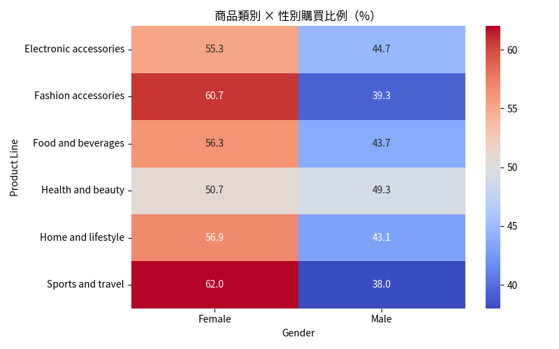
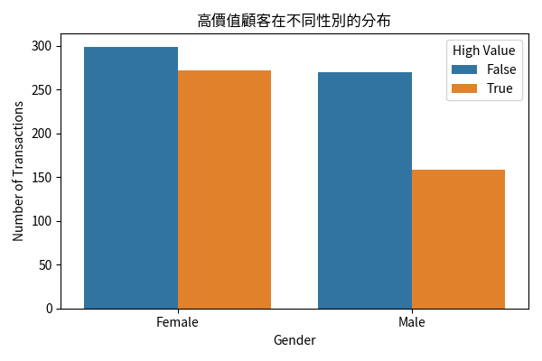
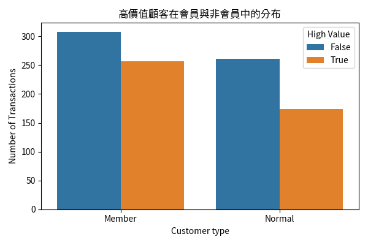
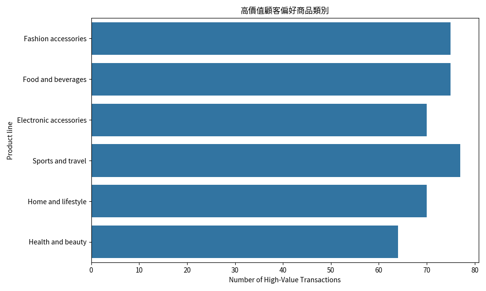

#  Supermarket Sales 分析報告

##  資料來源
- 使用 [Supermarket Sales Dataset](https://www.kaggle.com/datasets/aungpyaeap/supermarket-sales)
- 共包含銷售日期、商品種類、客戶資訊、付款方式等多維度欄位

---

##  分析目標

1. 探索資料中的城市、性別、商品線等對銷售的影響
   1) 主題 1：每日銷售趨勢（時間序列）
   2) 主題 2：城市 × 小時分佈（群體比較）
   3) 主題 3：會員 vs 非會員的購買偏好比較（群體分析）
   4) 主題 4：性別 vs 商品類別偏好分析（群體比較）
   5) 主題 5：高價值顧客分析（High-Value Customers）
2. 建立預測模型，判斷顧客是否為高價值會員（HighValueMember）
   1) 主題6 機器學習模型：預測顧客是否為「高價值會員」
---

##  分析結果：
### 主題 1：每日銷售趨勢（時間序列）

根據每日銷售資料，觀察到整體銷售呈現穩定波動。 其中最高銷售發生在 2019-03-09，總額為 7474.05。 為了更好地觀察趨勢，加入 7 日移動平均線，顯示銷售量在月初和月底皆有小幅高峰，可能與行銷活動有關。

### 主題 2：城市 × 小時分佈（群體比較）

可根據各城市高峰銷售時間去做行銷調整，各城市高峰銷售時間：
* Mandalay: 19:00
* Naypyitaw: 13:00 or 19:00
* Yangon: 11:00 or 15:00

### 主題 3：會員 vs 非會員的購買偏好比較（群體分析）

「會員（Member）與一般顧客（Normal）對各類商品的偏好是否不同？」
這可以幫助行銷團隊設計會員專屬品項推薦與非會員導入機制（針對常購商品推廣會員）

從圖中可以觀察到:
* 會員偏好"Food and beverage"
* 非會員偏好"Fashion accessories"和"Eletronic accessories"

針對會員可以推廣高價值商品，非會員可以利用他們偏好的品相誘導成為會員。

### 主題 4：性別 vs 商品類別偏好分析（群體比較）

「男性與女性在商品類別的購買偏好是否有差異？」提出此問題有助於觀察商品行銷策略（男生偏好電子？女生偏好美容？），
或是設計性別導向的推薦系統或折扣活動
商品類別 × 性別 百分比分布
	              

|Product line \ Gender | Female        |      Male    | 
|----------------------|---------------|--------------|
|Electronic accessories|	         55.3|	        44.7|
|Fashion accessories	 |           60.7|        	39.3|
|Food and beverages	   |           56.3|        	43.7|
|Health and beauty	   |           50.7|        	49.3|
|Home and lifestyle	   |           56.9|         	43.1|
|Sports and travel	   |           62.0|         	38.0|

用熱力圖顯示

從圖中可以觀察：

* 女性對於「Fashion accessories」與「Sports and travel 」類別的購買筆數高於男性
* 男性對於「Electronic accessories」與「Food and beverages 」相對活躍
* 女性消費力比男性高
*「Health and beauty」男性與女性相差不多
* 最大差距出現在「Sports and travel」（女 62%）

→ 可進一步挖掘女性對運動商品的需求與行為模式

→ 可以主打性別廣告，針對這些品類強化轉換率

→ 檢視是否超市該品類項目少或是雙方皆重視健康美容，可雙向行銷策略或是使用中性行銷語言

若有顧客年齡、會員狀態，可再進一步交叉分析「年齡 × 性別 × 品類」

### 主題 5：高價值顧客分析（High-Value Customers）
誰是店內的高價值顧客？他們有什麼特徵（性別、顧客類型、偏好商品）？
* 高消費顧客偏好什麼商品？
* 是否為會員較常出現高額消費？
* 我們能針對高價值顧客進行個人化行銷嗎？

→ 先建立高價值顧客定義：單筆交易金額>300

女性高價值顧客多於男性

會員族群中高價值顧客佔比顯著高於非會員

高價值顧客集中在運動與旅遊，其次是時尚配件與食物類

小結觀察：

* 有43.1%的交易為高價值顧客
* 女性、會員為主，最為偏好商品為運動旅遊類
* 可針對此類顧客推出ＶＩＰ推薦計畫與高消費回饋機制，促進再購買與口碑行銷

### 主題6 機器學習模型：預測顧客是否為「高價值會員」
使用 Logistic Regression（邏輯回歸）模型進行分類預測

目標（Target）：是否為「高價值顧客 + 會員」
---

##  特徵工程與變數轉換

- 日期轉換為 datetime 格式，擷取 Hour、Day
- 對類別欄位進行 one-hot encoding
- 建立衍生欄位：
  - `HighValueMember`：根據 Sales銷售金額 是否大於中位數標記高價值顧客

---

##  特徵選擇方法比較

| 方法          | 機制說明                                 | 結果                             |
|---------------|------------------------------------------|----------------------------------|
| SelectKBest   | 根據 F-score 排序，選出前 k 個變數        | `Quantity`, `Unit price`, `Gender_Male` |
| RFECV         | 用交叉驗證反覆遞迴移除變數                | 選出 13 個變數                  |
| Logistic coef | 根據邏輯回歸的係數大小                    | 前三名為 `Quantity`, `Unit price`, `Gender_Male` |

與原始使用 13 個特徵的模型相比，精簡模型的表現僅略低，但大幅提升模型簡潔性與可解釋性，適合應用於商業報表、自動化分析中。

> 結論：這三個變數可視為最核心的高價值會員預測因子，但後續可以再考慮是否有交互作用的因子，或是使用非線性模型例如：決策樹去看是否提升準確率
---

##  建模：Logistic Regression 模型

###  精簡模型結果
- Accuracy：0.78
- Precision（高價值顧客）：0.62
- Recall：0.50
- F1-score：0.55

---
